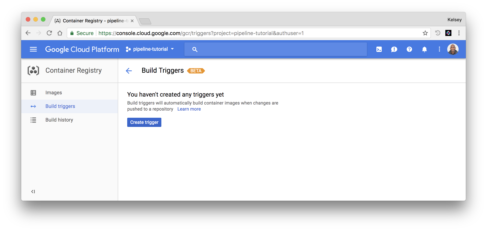
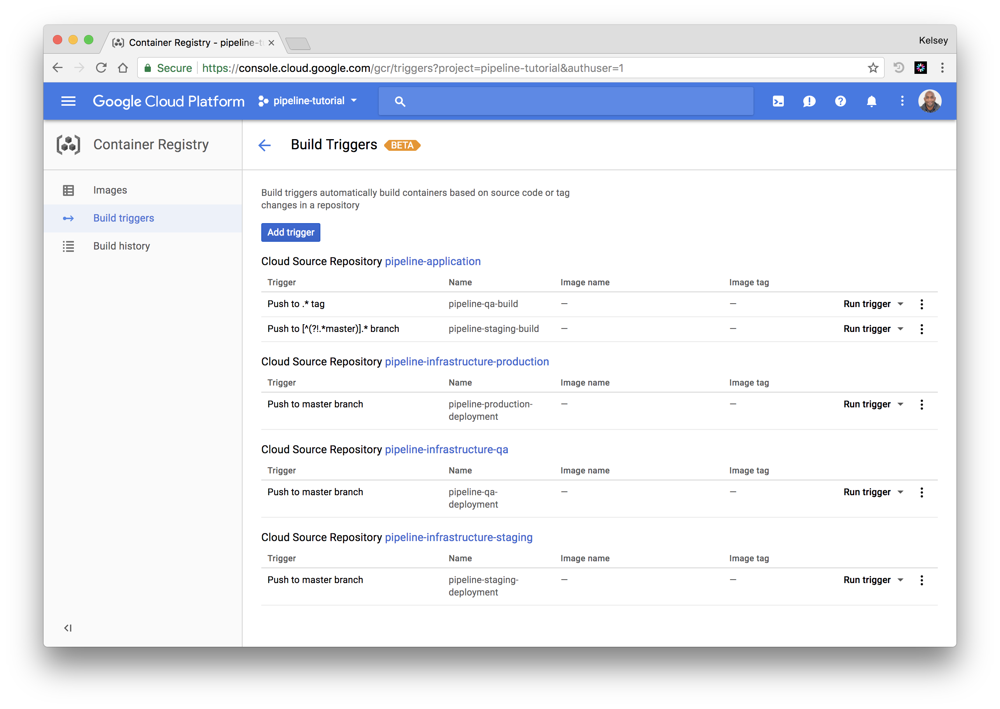

# Container Builder Build Triggers

In this section you will create the [Container Builder](https://cloud.google.com/container-builder) build triggers necessary to establish an [end-to-end build pipeline](deployment-pipeline.md).



## Prerequisites

Ensure the default credentials are available on your local machine:

```
gcloud auth application-default login
```

## Generate Container Builder Build Trigger Configurations

In this section you will generate the build trigger configuration payloads that will be used to automated the creation of the Container Builder build triggers hosted on GCP.

Retrieve the default compute zone and store it in the `COMPUTE_ZONE` env var:

```
export COMPUTE_ZONE=$(gcloud config get-value compute/zone)
```

### Generate the `pipeline-staging-build` Build Trigger Configuration File

Create a build trigger that rebuilds the pipeline application container image and updates the Kubernetes deployment configuration files for the staging cluster. This trigger will fire when changes are pushed to the `${GITHUB_USERNAME}/pipeline-application` GitHub repository on any branch except the master.

```
cat <<EOF > pipeline-staging-build-trigger.json
{
  "triggerTemplate": {
    "projectId": "${PROJECT_ID}",
    "repoName": "pipeline-application",
    "branchName": "[^(?!.*master)].*"
  },
  "description": "pipeline-staging-build",
  "substitutions": {
    "_GITHUB_USERNAME": "${GITHUB_USERNAME}",
    "_KMS_KEY": "github",
    "_CLOUDSDK_COMPUTE_ZONE": "${COMPUTE_ZONE}",
    "_CLOUDSDK_CONTAINER_CLUSTER": "staging",
    "_KMS_KEYRING": "pipeline"
  },
  "filename": "staging/cloudbuild.yaml"
}
EOF
```

### Generate the `pipeline-qa-build` Build Trigger Configuration File

Create a build trigger that rebuilds the pipeline application container image and updates the Kubernetes deployment configuration files for the qa cluster. This trigger will fire when a new tag is pushed to the `${GITHUB_USERNAME}/pipeline-application` GitHub repository.

```
cat <<EOF > pipeline-qa-build-trigger.json
{
  "triggerTemplate": {
    "projectId": "${PROJECT_ID}",
    "repoName": "pipeline-application",
    "tagName": ".*"
  },
  "description": "pipeline-qa-build",
  "substitutions": {
    "_KMS_KEYRING": "pipeline",
    "_GITHUB_USERNAME": "${GITHUB_USERNAME}",
    "_KMS_KEY": "github",
    "_CLOUDSDK_COMPUTE_ZONE": "${COMPUTE_ZONE}",
    "_CLOUDSDK_CONTAINER_CLUSTER": "qa"
  },
  "filename": "qa/cloudbuild.yaml"
}
EOF
```

### Generate the `pipeline-staging-deployment` Build Trigger Configuration File

Create a build trigger that applies the Kubernetes deployment configuration files for the staging cluster. This trigger will fire when changes are pushed to the `${GITHUB_USERNAME}/pipeline-infrastructure-staging` GitHub repository on the master branch.

```
cat <<EOF > pipeline-staging-deployment-trigger.json
{
  "triggerTemplate": {
    "projectId": "${PROJECT_ID}",
    "repoName": "pipeline-infrastructure-staging",
    "branchName": "master"
  },
  "description": "pipeline-staging-deployment",
  "substitutions": {
    "_CLOUDSDK_CONTAINER_CLUSTER": "staging",
    "_CLOUDSDK_COMPUTE_ZONE": "${COMPUTE_ZONE}"
  },
  "filename": "cloudbuild.yaml"
}
EOF
```

### Generate the `pipeline-qa-deployment` Build Trigger Configuration File

Create a build trigger that applies the Kubernetes deployment configuration files for the qa cluster. This trigger will fire when changes are pushed to the `${GITHUB_USERNAME}/pipeline-infrastructure-qa` GitHub repository on the master branch.

```
cat <<EOF > pipeline-qa-deployment-trigger.json
{
  "triggerTemplate": {
    "projectId": "${PROJECT_ID}",
    "repoName": "pipeline-infrastructure-qa",
    "branchName": "master"
  },
  "description": "pipeline-qa-deployment",
  "substitutions": {
    "_KMS_KEYRING": "pipeline",
    "_GITHUB_USERNAME": "${GITHUB_USERNAME}",
    "_CLOUDSDK_COMPUTE_ZONE": "${COMPUTE_ZONE}",
    "_CLOUDSDK_CONTAINER_CLUSTER": "qa",
    "_KMS_KEY": "github"
  },
  "filename": "cloudbuild.yaml"
}
EOF
```

### Generate the `pipeline-production-deployment` Build Trigger Configuration File

Create a build trigger that applies the Kubernetes deployment configuration files for the production cluster. This trigger will fire when changes are pushed to the `${GITHUB_USERNAME}/pipeline-infrastructure-production` GitHub repository on the master branch.

```
cat <<EOF > pipeline-production-deployment-trigger.json
{
  "triggerTemplate": {
    "projectId": "${PROJECT_ID}",
    "repoName": "pipeline-infrastructure-production",
    "branchName": "master"
  },
  "description": "pipeline-production-deployment",
  "substitutions": {
    "_CLOUDSDK_COMPUTE_ZONE": "${COMPUTE_ZONE}",
    "_CLOUDSDK_CONTAINER_CLUSTER": "production"
  },
  "filename": "cloudbuild.yaml"
}
EOF
```

## Create the Container Build Triggers

In this section you will create the Cloud Builder build triggers by submitting the build trigger configuration files generated in the previous section using the GCP API.

Create a cloud build trigger for each build trigger configuration file:

```
BUILD_TRIGGER_CONFIGS=(
  pipeline-staging-build-trigger.json
  pipeline-qa-build-trigger.json
  pipeline-staging-deployment-trigger.json
  pipeline-qa-deployment-trigger.json
  pipeline-production-deployment-trigger.json
)
```

```
for config in ${BUILD_TRIGGER_CONFIGS[@]}; do
  curl -X POST \
    https://cloudbuild.googleapis.com/v1/projects/${PROJECT_ID}/triggers \
    -H "Content-Type: application/json" \
    -H "Authorization: Bearer $(gcloud auth application-default print-access-token)" \
    --data-binary @${config}
done
```

At this point all the build triggers are in place.



Next: [Test the Pipeline](test-the-pipeline.md)
