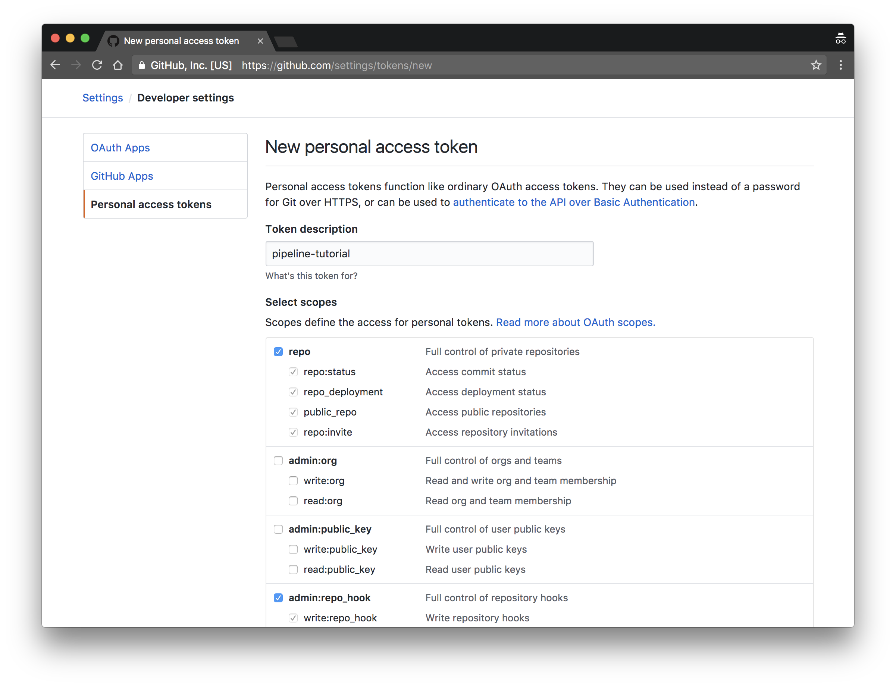

# Prerequisites

## Services

The following services are required to complete this tutorial:

* [GitHub](https://github.com)
* [Google Cloud Platform](https://console.cloud.google.com/freetrial)

## Create a New Project and Enable Google Cloud Platform APIs

In this section you will create a new GCP project and enable the Google Cloud Platform APIs required to complete this tutorial.

Create a new project named `pipeline-tutorial` and capture the projectId in the `PROJECT_ID` env var:

```
PROJECT_ID=$(gcloud projects create \
  --name "pipeline-tutorial" \
  --format='value(projectId)')
```

> At the prompt type 'y' to accept generated project id.

Set the default project:

```
gcloud config set project ${PROJECT_ID}
```

> Creating new projects with the `--set-as-default` flag does not seem to work as of gcloud version (Google Cloud SDK 180.0.0) and results in the core/project property being set to None. As a workaround the projectId is being extracted from the output of the gcloud command and stored in an env var and set manually.

Enable the required GCP APIs:

```
gcloud services enable --async \
  container.googleapis.com \
  cloudapis.googleapis.com \
  cloudbuild.googleapis.com \
  sourcerepo.googleapis.com \
  compute.googleapis.com \
  storage-component.googleapis.com \
  containerregistry.googleapis.com \
  cloudkms.googleapis.com \
  logging.googleapis.com \
  cloudfunctions.googleapis.com
```

In can take several minutes before the GCP APIs are enabled and ready for use. In the meanwhile it's safe to continue the tutorial. At any point you can use the `gcloud` command to list enabled services:

```
gcloud services list --enabled
```

> output

```
NAME                               TITLE
bigquery-json.googleapis.com       BigQuery API
clouddebugger.googleapis.com       Stackdriver Debugger API
datastore.googleapis.com           Google Cloud Datastore API
source.googleapis.com              Legacy Cloud Source Repositories API
storage-component.googleapis.com   Google Cloud Storage
pubsub.googleapis.com              Google Cloud Pub/Sub API
container.googleapis.com           Google Container Engine API
storage-api.googleapis.com         Google Cloud Storage JSON API
logging.googleapis.com             Stackdriver Logging API
resourceviews.googleapis.com       Google Compute Engine Instance Groups API
replicapool.googleapis.com         Google Compute Engine Instance Group Manager API
cloudapis.googleapis.com           Google Cloud APIs
sourcerepo.googleapis.com          Cloud Source Repositories API
deploymentmanager.googleapis.com   Google Cloud Deployment Manager V2 API
containerregistry.googleapis.com   Google Container Registry API
monitoring.googleapis.com          Stackdriver Monitoring API
compute.googleapis.com             Google Compute Engine API
sql-component.googleapis.com       Google Cloud SQL
cloudkms.googleapis.com            Google Cloud Key Management Service (KMS) API
cloudtrace.googleapis.com          Stackdriver Trace API
servicemanagement.googleapis.com   Google Service Management API
replicapoolupdater.googleapis.com  Google Compute Engine Instance Group Updater API
cloudbuild.googleapis.com          Google Cloud Container Builder API
cloudfunctions.googleapis.com      Google Cloud Functions API
```

Link a billing account to the `pipeline-tutorial` project as described here: [Modify a Project's Billing Settings](https://cloud.google.com/billing/docs/how-to/modify-project)

## Install the Client Tools

The following client tools are required to complete this tutorial:

 * [hub](https://github.com/github/hub) 2.3.0+
 * [hub-credential-helper](https://github.com/kelseyhightower/hub-credential-helper) 0.0.1+
 * [git](https://git-scm.com/downloads) 2.14.0+
 * [gcloud](https://cloud.google.com/sdk) 179.0.0+
 * [kubectl](https://github.com/kubernetes/kubernetes/blob/master/CHANGELOG-1.8.md#downloads-for-v183) 1.8.0+

 ## Generate a GitHub API Token

 In this section you will generate a [GitHub API Token](https://github.com/blog/1509-personal-api-tokens) which will be used to automate the GitHub related tasks throughout this tutorial.

 Generate a GitHub token using the official [guide](https://github.com/blog/1509-personal-api-tokens). While creating the token, set the token description to "pipeline-tutorial", and check the `repo` and `admin:repo_hook` scopes.

 

 Save the token in the `GITHUB_TOKEN` environment variable:

 ```
 export GITHUB_TOKEN="<token>"
 ```

 Your GitHub username will be used to automate GitHub related tasks including forking the GitHub repositories necessary to complete this tutorial and creating [GitHub webhooks](https://developer.github.com/webhooks/). Save your GitHub username in the `GITHUB_USERNAME` env var:

 ```
 export GITHUB_USERNAME="<github-username>"
 ```
